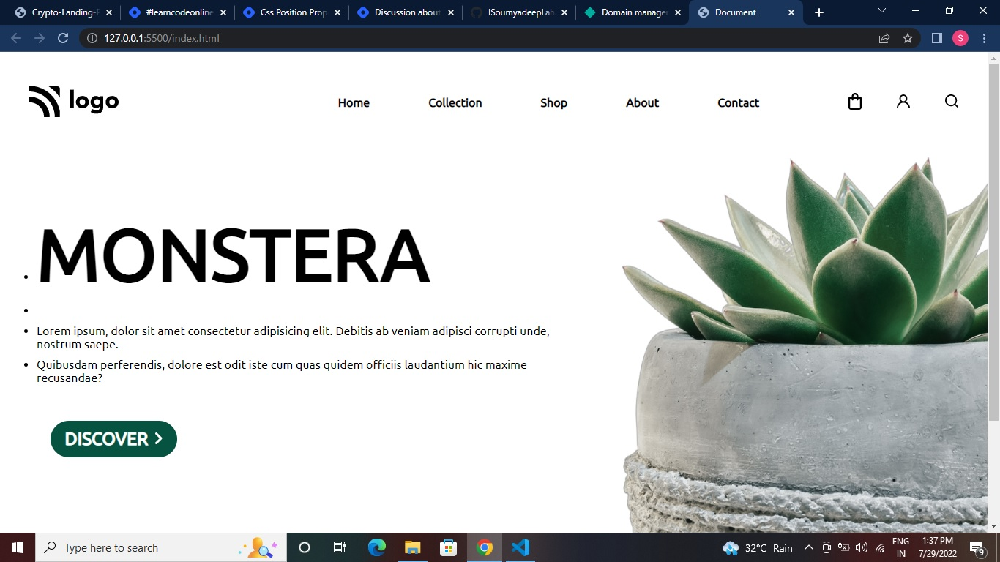
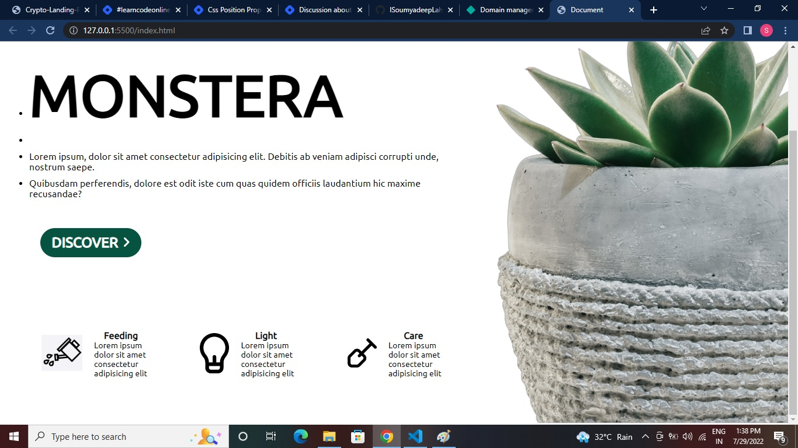

# Plant Home Page (Project 06)

by Soumyadeep Laha

## I have learned from this page

- How to target any HTML element using CSS id selector.
- More on flexbox property.
- How to use CSS Box Model.

## Time to complete this project

Hoestly it was a bit complicated one, I was doing some mistake that is, I was using class selector and then I realise here we need to target html elements using id selector. So after that I have completed using id selector.

So total time taken to complete the project is 2 hours 20 mins

## Here are the Screen Shorts of the project

---

## Here is the live link of the project

[Netlify Link...](https://plant-home-page-proj06.netlify.app/)